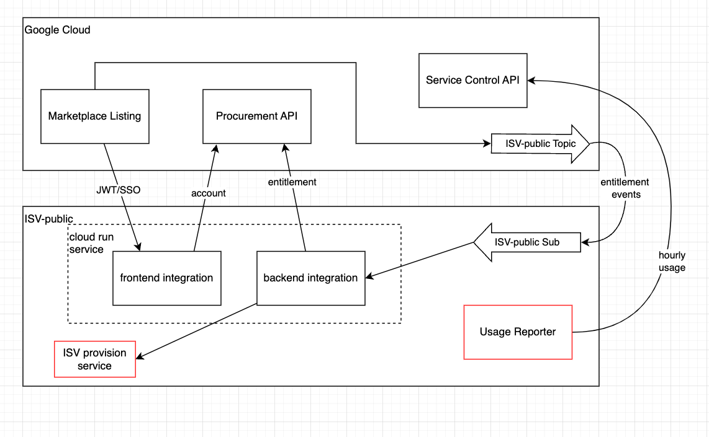

## Architectural diagram

## Architecture description

Doit-Easily is a the minimum required implementation for a SaaS backend listing. 

## How the data flows

## Component Descriptions

### GCP owned

* **marketplace listing**: The marketplace listing that your customers use to subscribe to your service. Used for public and private offers.

* **procurement api**: REST API to inform Google about entitlements and account statuses.

* **service api**: REST API to inform Google about usage for usage-based billing.

* **isv-public topic**: Pub/sub topic where Google publishes entitlement events (creation requested, update requested, etc.).

### ISV owned

* **frontend-integration**: The public website where customers are redirected to after subscribing to your listing. It conducts JWT validation and gives you an opportunity to collect additional customer information (for storing in your own DB).

* **backend-integration**: The service to receive and respond to entitlement events from Google. Provides a simplified API to interact with the procurement API.

* **isv-public subscription**: Subscription to the "isv-public topic".

* **isv provision service**: An optional service (not provided by this repository) that listens to events from the backend-integration. This service would provision resources in your backend for SaaS customers.

* **usage-reporter**: An optional service (only required for usage-based billing, not provided by this repository) that reports usage metrics to Google's Service API.

* **service account**: The doit-easily service account that runs your backend-integration. This service account has roles to interact with the procurement API and subscribe to the isv-public topic.
