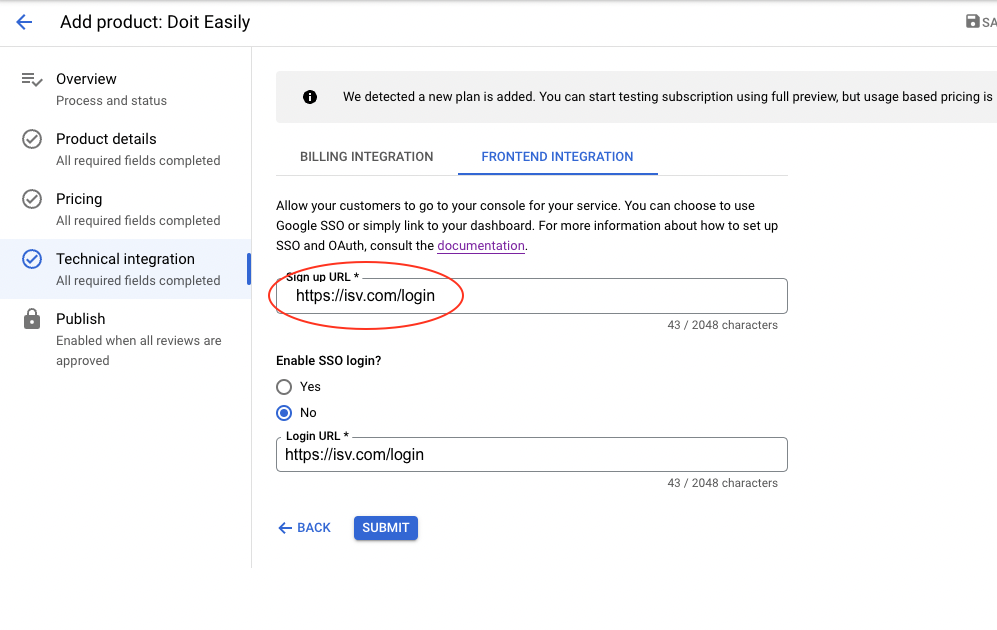

# Deploy the App

1. Build and publish the DoiT-Easily image

   For detailed instructions see the [api readme](../../api/README.md)

1. Create a copy of the [example.tfvars](../terraform/app_deploy/example.tfvars) file and update your values.  

   For detailed instructions about the module, see this [README](../terraform/app_deploy/README.md)

1. Apply the Terraform     

   Make sure you update the secret in Secret Manager and bump the secret version in tfvars and redeploy the service 

1. In the Producer Portal, add the frontend integration URL to the Technical Integration -> Frontend Integration `Sign up URL`.

     1. (Optional.) Add the SSO Login URL for your console, and support SSO. OR link to your website and disable SSO

   

# Next Steps

[test the deployment](4-test-deployment.md)