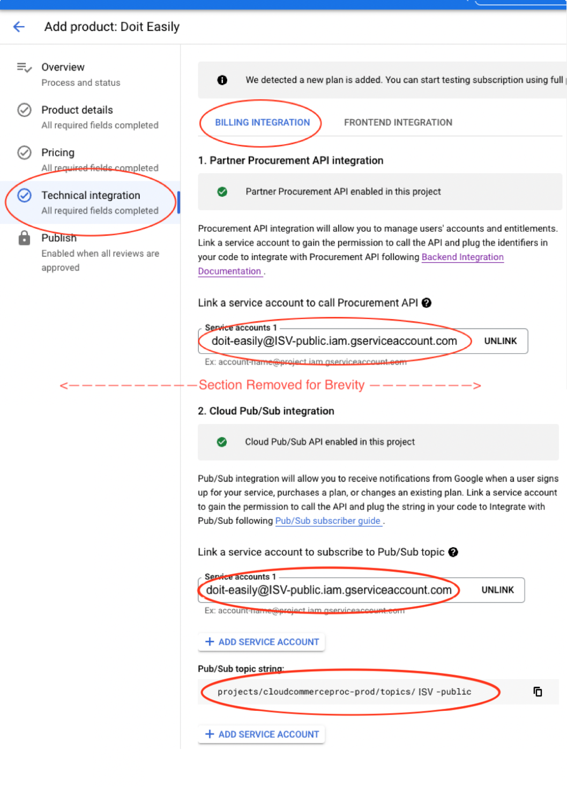
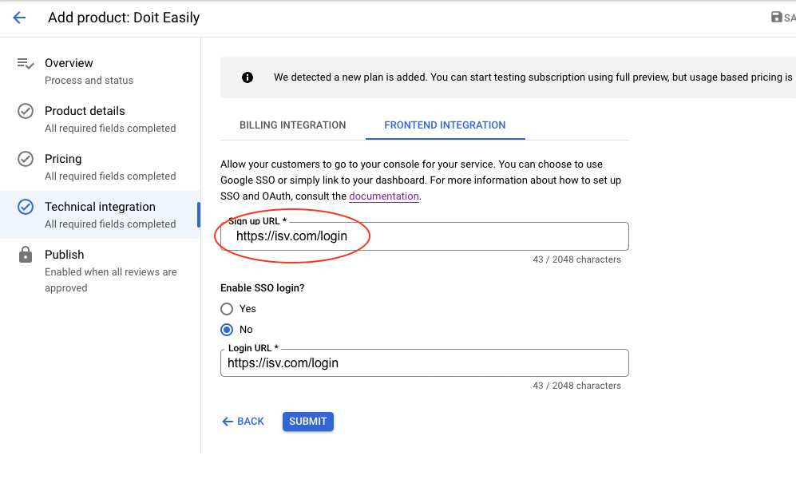

# Install Doit-Easily

This process is the distilled instructions found [here][3], plus information to deploy Doit-Easily.

**Terraform modules**

There are two Terraform modules in this directory: `setup` and `app_deploy`. They correspond with installation steps below.

You can apply the modules using either one of the following methods:

- Adding a `.tfvars` file with appropriately configured variables to directly apply the entire modules.

- Copying the pertinent files to your own terraform modules and apply them there.

We recommend the first approach, using the requested variables.

## Setup

Note: These steps can be accomplished by applying this [Terraform][6] or [gcloud][7].
[Terraform][6] is preferred way to execute the setup.

1. Create a project to hold your listings and backend integration workloads. The project name should be in the format `ISV-public`.

1. Grant Google procurement user access to your listing project ([role detail][9]).

1. Create a service account to run your integration workloads.

1. Verify that the user applying the app deploy terraform has `serviceAccountTokenCreator` role on the `doit-easily` SA created in this step

## Create a listing and start submitting details

The following steps are completed in your web browser and Producer Portal.

1. Submit your product information using this [Google Form][1].

1. Create a new SaaS listing in the [Producer Portal][2]. 

1. Start the process of submitting pricing & product information. This can be done in parallel to the technical integration.  

1. In the Producer Portal (see screen capture below):

   1. Link the service account to call the Procurement API and Cloud Pub/Sub Integration.

   1. Copy the Pub/Sub topic string for later users.
       Use the format `projects/cloudcommerceproc-prod/topics/ISV-public`.

       
  
        
Screen Capture
  
      
          
       

1. (Optional) In Slack, create a Slack webhook to store this secret in Secret Manager.

## Deploy the App

Note: These steps can be accomplished by applying this [Terraform][8].

#### Please see the [README][11] for important instructions about deploying the app and its prerequisites.

1. Deploy the application in Cloud Run. When finished, continue below.

## Finish and test the integration

1. In the Producer Portal, add the frontend integration URL to the Technical Integration -> Frontend Integration `Sign up URL`.

     1. (Optional.) Use a custom domain by setting up a load balancer in front of Cloud Run.

     2. (Optional.) Add the SSO Login URL for your console, and support SSO. OR link to your website and disable SSO

   

   
Screen Capture

   
   
  

1. To test the integration, see our [detailed doc on testing][10]

1. Submit the product details, pricing details, and technical integration for review by Google.

1. Publish your listing.

[1]: https://docs.google.com/forms/d/e/1FAIpQLSfddn4mwKnqtLNQ-m7IgRZ-bgTz4BOsrEDWCf3XBjc_ogKNnA/viewform
[2]: https://console.cloud.google.com/producer-portal
[3]: https://cloud.google.com/marketplace/docs/partners/integrated-saas#checklist
[5]: install-cloudrun.md
[6]: terraform/setup
[7]: gcloud/setup
[8]: terraform/app_deploy
[9]: terraform/setup/iam.tf
[10]: testing.md
[11]: terraform/app_deploy/README.md
